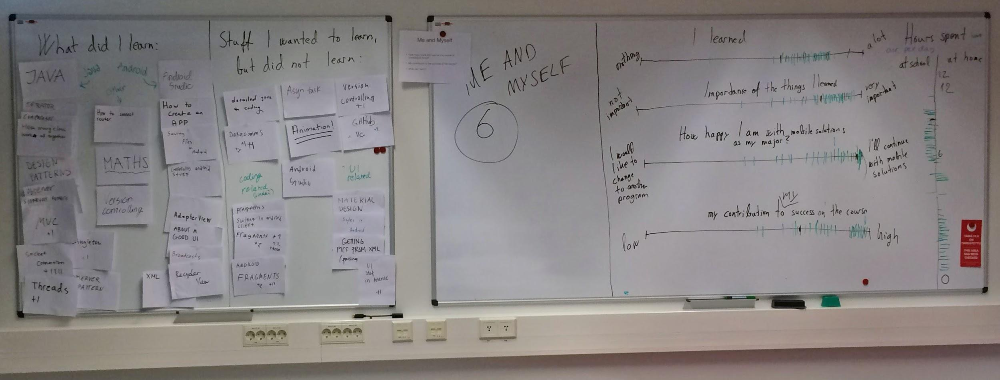

*Promoting Knowledge Practices in Education (KNORK) http://knork.info*

*The Re-use Library*

**Educational design pattern: Course feedback workshop**

**Author(s)**: Petri Vesikivi

**Affiliation(s)**: Helsinki Metropolia University of Applied Sciences, Finland

**Date of publication**: June 21st, 2016

**1. The educational problem**

Continuous development of courses would require comprehensive feedback from the participants of the course. The most widely used form of feedback is a questionnaire that is filled in after the course is completed. This approach has two main problems: timing of the feedback and one-way nature of the feedback. Furthermore, it is fairly challenging to get students answer open questions and therefore questionnaires quite often use mostly closed questions. Many times the answers to closed questions like “How would you rate the content of the course on scale 1...5?” provide very little help in developing the course further as it is not possible to know what the respondent thought was the problem with the course content.

For the trialogical approach, timing of the traditional feedback collection is the most important problem: it does not provide information for developing the course content during the course. It is like looking at a car’s back mirror.

One-way nature of the feedback diminishes possibilities of gaining comprehensive understanding of concerns of students as it is often impossible to ask clarifying questions about the feedback given by the students.

**2. The solution**

*Therefore*, we have developed and tried out a more interactive approach to feedback process involving a course planning workshop, weekly feedback questionnaires and a course feedback workshop on the last week of the course. The workshops involves students on the course and the teachers giving the course.

Pre-course workshop was organized in the middle of the course preceding the course being planned. Topic areas designed to be covered on the course were written on one white board each. Students were divided into same number of teams as there were topics (and white boards). Each team got five minutes to fill in the “topic board” with their ideas about what should be covered. One white board covered course practicalities like the share between lectures/individual work/teamwork. After every team had visited each whiteboard, the whole group of students and teachers went to each whiteboard to discuss the topic. At this time it was also possible to ask clarifying questions about the input from students. A picture was taken of each whiteboard and the suggestions were used when planning the upcoming course.

During the course we used a weekly questionnaire:

1.  What did I learn this week?

> The meaning of this exercise is to learn from an experience and to support your learning by going back to the experience by writing. Focus on your own learning and reflect your ideas by using full sentences. Use the questions below to help your thinking, do not only answer to the questions. What were your general thoughts after the week? What kind of thoughts and ideas arouse to you concerning the themes presented? What did you do well? What was difficult to understand? What would you like to learn more? What could you have done differently? How can you combine this week to your prior learning in the course? Where do you need to focus more next week?
>
> 2) What helped me in learning?
>
> 3) What prevented me from learning?

The questionnaire helped us to understand what things possible needed still some more work and which ones were clear. It also made it possible to change the course practices and adjust the course content already during the course.

The process we suggest for a course feedback workshop is as follows:

1.  Define 5-10 topics for feedback.

2.  Arrange a room with a whiteboard for each topic. Mark each board with a number.

3.  Split students into same number of random teams as there are boards.

4.  At the start, each student team will take one board and write feedback on the board.

5.  After five minutes the teams move to the next board until each team has visited all boards.

6.  10 minutes break, during which teachers will quickly analyze the feedback and mark down any unclear items.

7.  Feedback is discussed with the whole class and unclear items are clarified.

8.  A draft list of actions based on the feedback is created.

The course feedback workshop was done on the last day of the course following the same concept as the pre-course workshop. On the course, the topics we picked were:

1.  Integration of topics (Object oriented programming, user experience design, datacommunications, math)

2.  Group/team work and learning

3.  What did I learn?/Stuff I wanted to learn, but did not.

4.  Course content/How the course was conducted?

5.  Wish list for the next course.

6.  Me and myself (I learned a lot/not much, Importance of the things I learned, My satisfaction level with the current major, My contribution to the success of the course, How many hours I used for the course at the school and at home)

Figure 1. Examples of feedback boards.

Students were randomly divided into six groups of 5-6 students and each group spent five minutes giving input on each board. After the whole round was completed, everyone gathered at each whiteboard to discuss and clarify the things raised on the board. The boards were documented by taking picture of each board (see Figure 1).

All participants, teachers and students alike, shared the idea that the the feedback workshop provided much more useful feedback for planning the next implementation of the course than a typically course questionnaire would have provided.

**3. The context**

This way of collecting feedback works best on courses that have several topic areas and multiple teachers. Workshops take 1.5 hours each which means that this way of collecting feedback would call for a certain size of the course. The courses were we have used this were 15 ECTS courses.
