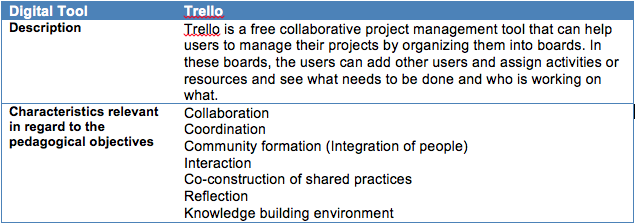
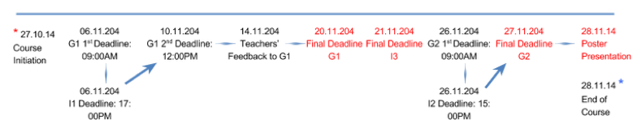
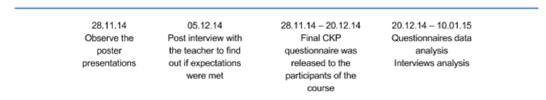

*Promoting Knowledge Practices in Education (KNORK) http://knork.info*

*The Re-use Library*

**Pedagogical case: Health care organisation and management (Higher Education; Health Informatics)**

**Author(s)**: Elnta Meragia & Klas Karlgren

**Affiliation(s)**: Karolinska Institutet

**Date of publication**: March 20, 2015

**The educational problem**

In higher education students are frequently faced with challenges such as how to work effectively in groups, how to produce high quality material when submitting a group assignment and how to deal successfully with deadlines. This need is even higher for students who are in the first year of their studies and who have not worked like this before.

**The solution**

In order to solve this educational problem a solution could be to enhance students’ cooperation, collaboration and organization in their groups. To do so a web based tool that can enhance collaboration, coordination, integration of activities and interaction within the group members is suggested.

**Key experiences**

Enhancing students’ cooperation, collaboration and organization in their groups through a web-based tool can be a challenge. Students tend to question the usability of such a tool for their group work. Also, it can take some time for the teacher to organize and set up not only the digital accounts but also to slightly modify the way the course is usually delivered.

The main success however can be seen in the long run. Students through time learn to set up rules for their group work and undertake responsibility as a group by using such a web based tool. They gain important skills, which they can use not only for their future courses but also eventually for their future jobs. On the other hand, the teacher might spend a lot of time in the beginning of the course to organize this but in the long run it leaves him more time to concentrate on other aspects of the course.

**Materials and links**

**Implementing the trialogical design principles**

| *Design principle*                                                                           | *Implementation in the case*                                                                                                                                                                                                                                                                                                                                                                                                   |
|----------------------------------------------------------------------------------------------|--------------------------------------------------------------------------------------------------------------------------------------------------------------------------------------------------------------------------------------------------------------------------------------------------------------------------------------------------------------------------------------------------------------------------------|
| DP1: Organising activities around shared objects                                             | **Shared Objects: **                                                                                                                                                                                                                                                                                                                                                                                                           
                                                                                                                                                                                                                                                                                                                                                                                                                                                                                                                                
                                                                                                -   A shared document to describe a Health Care System in three settings                                                                                                                                                                                                                                                                                                                                                        
                                                                                                                                                                                                                                                                                                                                                                                                                                                                                                                                
                                                                                                -   Poster solution from each group                                                                                                                                                                                                                                                                                                                                                                                             
                                                                                                                                                                                                                                                                                                                                                                                                                                                                                                                                
                                                                                                **Activities:** Groups of students collaborate to create a document describing a health care system and the groups create a poster with a possible solution around the problem they have to tackle                                                                                                                                                                                                                              |
| DP2: Supporting integration of personal and collective agency and work                       | **Participants:** The groups consist of students who take positions according to their experiences and background                                                                                                                                                                                                                                                                                                              
                                                                                                                                                                                                                                                                                                                                                                                                                                                                                                                                
                                                                                                **Collective activities:** Students take the responsibility for the group assignments. They are expected to set rules and define roles in the groups so that everyone can contribute equally.                                                                                                                                                                                                                                   
                                                                                                                                                                                                                                                                                                                                                                                                                                                                                                                                
                                                                                                **Collective responsibility:** All members are expected to contribute to the group assignments. It is up to them how to collaborate and share the work.                                                                                                                                                                                                                                                                         |
| DP3; Emphasizing development and creativity through knowledge transformations and reflection | **Practical Problems:** For the group work, the tool has already been set up for the students in order to start using it. Through that they can organize and manage their time plan and also share resources. In the common forum students can take part in discussions.                                                                                                                                                       
                                                                                                                                                                                                                                                                                                                                                                                                                                                                                                                                
                                                                                                **Reflection:** Students are expected to provide feedback and reflect on the group assignments on an individual basis.                                                                                                                                                                                                                                                                                                          |
| DP4: Fostering long-term processes of knowledge advancement                                  | **Previous achievements:** The course is conducted in the beginning of the first semester of the first year of the master. Students are not expected to have previous experience on the subject.                                                                                                                                                                                                                               
                                                                                                                                                                                                                                                                                                                                                                                                                                                                                                                                
                                                                                                **Iterations:** Students are offered the opportunity to improve their submissions throughout time for all of their assignments.                                                                                                                                                                                                                                                                                                 
                                                                                                                                                                                                                                                                                                                                                                                                                                                                                                                                
                                                                                                **Planning use for the outcomes:** To help health informatics students to develop insight into the mission, function, organization, and the unique characteristics of their future work environment - health care.                                                                                                                                                                                                              
                                                                                                                                                                                                                                                                                                                                                                                                                                                                                                                                
                                                                                                **Extending idea development:** The course gives basis on real health informatics issues that are identified in other courses in the program.                                                                                                                                                                                                                                                                                   |
| DP5: Promoting cross-fertilization of knowledge practices and artifacts across communities   | **Things to consider in the future**                                                                                                                                                                                                                                                                                                                                                                                           
                                                                                                                                                                                                                                                                                                                                                                                                                                                                                                                                
                                                                                                **Collaboration with professionals:** The issues that the students are expected to work with, are examples from real health informatics settings where they are expected to offer related health informatics solutions. However, no contact with clients will be possible. (The course is too basic and too early in the process)                                                                                               
                                                                                                                                                                                                                                                                                                                                                                                                                                                                                                                                
                                                                                                **Shared problem:** The students and the teachers have different backgrounds and expectations and collaborate in order to achieve the requisites of the course.                                                                                                                                                                                                                                                                 
                                                                                                                                                                                                                                                                                                                                                                                                                                                                                                                                
                                                                                                **Templates and tools:** Students are free to choose templates and tools that best fit for their needs. For the poster session they have a pre defined poster template on which they can build their solutions.                                                                                                                                                                                                                 
                                                                                                                                                                                                                                                                                                                                                                                                                                                                                                                                
                                                                                                **Reflections:** Students can reflect throughout the course lectures or through the forum where they can express their ideas and views on the course. Also, in the end of the course, they are expected to provide feedback on the overall view of the course. Reflections are also possible through the groups. Discussion forum provides the possibility for formative feedback to adjust the course according to the needs.  |
| DP6: Providing flexible tools for developing artifacts and practices                         | Ping Pong is used as a Learning Management System (LMS) and which provides certain functions (e.g. PIMS, messages, common folders, learning material, group discussions, reminders etc) that facilitate the students.                                                                                                                                                                                                          
                                                                                                                                                                                                                                                                                                                                                                                                                                                                                                                                
                                                                                                **Tools and organization:** Ping Pong, Trello                                                                                                                                                                                                                                                                                                                                                                                   
                                                                                                                                                                                                                                                                                                                                                                                                                                                                                                                                
                                                                                                **Tools and learning community:** Ping Pong, KI email                                                                                                                                                                                                                                                                                                                                                                           
                                                                                                                                                                                                                                                                                                                                                                                                                                                                                                                                
                                                                                                **Tools and shared artifacts:** Common folder through Ping Pong, common board for time management, resources sharing and organization through Trello                                                                                                                                                                                                                                                                            
                                                                                                                                                                                                                                                                                                                                                                                                                                                                                                                                
                                                                                                **Tools and reflection:** Discussion forum in Ping Pong                                                                                                                                                                                                                                                                                                                                                                         |

**Detailed description of the pedagogical implementation**

**Background information**

Educational level: Postgraduate/Master

Topic: Health care organization and management

Subject domain(s): Health informatics

Duration: 5 weeks

**Course Background**

The course where Trialogical learning was applied is called Health care organization and management. Health care organization and management, is a compulsory course in the domain of health informatics, targeted at first semester health informatics students (with technical background) in Karolinska Institutet, Sweden. The course was set up in order to run for five weeks, from 27th of October 2014 until 28th of November 2014. The aim of the course was to help health informatics students to develop insight into the mission, function, organization, and the unique characteristics of their future work environment - health care. The course was designed to introduce them with a basic knowledge about current existing health systems and health care organization.

In the course participated one teacher and twelve students. The course consisted of a number of lectures and study visits related to the context of the course. As far as assignments were related, students were expected to work both individually and in groups. The learning management system that was used is called Ping Pong and which offered the following functions: messages, common folders, learning material sharing, group discussions, reminders, assignments submissions.

In total there were created three groups of four students and during their group work students had two assignments to complete:

1. Group Assignment 1: Health System Description (G1)

1.  The group was expected to describe in a document the health system in a selected country. They should use the Health system framework by WHO (health services, human resources, health informatics, medicines and technology, leadership and governance, financing and overall goals/outcomes) as a framework for analysis/description

2.  The group should also identify a problem, formulate a problem statement and suggest how health IT could be part of the solution to the problem

2. Group Assignment 2: Poster Presentation (G2)

1.  In the poster the group was expected to give an introduction to the problem that they had selected and argue why the problem was important

2.  Then the group should present the ICT tool that they believed could eliminate the problem by focusing on the main functionalities of the system. A discussion would follow up and finally, a conclusion.

During their individual assignments, students had to carry out the following tasks:

1. Provide peer feedback to Group Assignment 1 (I1)

The goal of this individual assignment was to provide helpful, constructive feedback to the group assignment 1 from one group to another. So, members from Group 1 would provide peer feedback to members in Group 2, members from Group 2 to members in Group 3, and members from Group 3 to members in Group 1.

2. Provide peer feedback to Group Assignment 2 (I2)

The goal of this individual assignment was to provide helpful, constructive feedback to the group assignment 2 from one group to another. So, members from Group 1 would provide peer feedback to members in Group 2, members from Group 2 to members in Group 3, and members from Group 3 to members in Group 1.

3. Write individual reflections on study visits (I3)

As part of the course, the students had a study visit to a pediatric emergency room in a hospital. The task for this assignment was to collect observations and information about structure and management of the emergency room, and especially how health informatics tools were used in management and development of care.

**Learning goals**

**Aim**

The aim of this course is to help health informatics students to develop insight into the mission, function, organization, and the unique characteristics of their future work environment - health care.

**Outcomes**

1. Knowledge and understanding

-   Identify and describe the goals of a health system and explain the building blocks using the WHO health system framework

-   Differentiate and describe the different challenges that health systems face in countries with different income

-   Explain the organizational complexity of health care and identify the management challenges in delivering value-based health care

-   Describe the burden of disease and disability on population level, both globally and locally

-   Elaborate the role of health informatics in supporting health care organization and management in different contexts (low-, middle- and high-income countries)

2. Skills and abilities

-   Compare how different health care systems use organizational and financial management to achieve the criteria for STEEEP\*

-   Propose how health informatics tools can be designed and adapted to current conditions in different health care systems

3. Assessment ability and attitudes

-   Assess the similarities and differences in health cares’ organizational and managerial challenges

-   Argue on using different health informatics tools depending on the health care context

**Preparations before the course**

In order for the course to be properly built according to Trialogical learning, it was essential that a number of steps would follow up in order to inform the teacher about it and also start building the course accordingly.

1. A workshop was organized with the teacher of the course and where the ideas of KNORK project were presented, what trialogical learning is and its design principles were analyzed. Examples from previous implementations of trialogical learning were also presented and important lessons learned where discussed.

2. A second meeting with the teacher followed up, so that we would see how the course could be built:

1.  The design principles were analyzed and discussed for the purpose of the course

2.  Agreed on what kind of technologies would be used regarding group assignments

3.  Discussed about the researcher’s role throughout the course (e.g. the researcher would facilitate either face to face or digitally the students regarding the use of digital tools)

4.  Agreed that the researcher would set up the accounts on Trello and the teacher would not have access on that material

5.  Together with the teacher the pedagogical scenario was written and discussed

3. A third meeting with the teacher followed up right before the initiation of the course in order to interview her and learn more about her views, expectations and concerns regarding the implementation of Trialogical learning in the course

4. An online pre questionnaire stating the purpose of the research and asking for permission to use data from the course was prepared and sent to the students of the course prior to the beginning of the course

5. Trello boards were created for the groups and invitations were sent to the members of the groups.

6. During the first day of the course, a presentation regarding KNORK project and my role as a researcher was given to the participants of the course. Also, a presentation of Trello and its main functions and possibilities were also exhibited.

**ICT tool(s)**

**Schedule and working phases**

Below is the timeline for the course, regarding its implementation. Most of the work was carried out before the course initiation and after the course ended (which I will call pre and after phases).

1.  During the Course Initiation, students and the teacher meet and have class activities where the teacher presents the theory of the course.

2.  Students form three groups of four and start working on the group assignments for the rest of the course. They are expected to create a document describing the health care system one setting and create a poster related to the problem they would like to deal with.

3.  Individually the students provide feedback on the assignments and submit an individual assignment based on a study visit.

4.  The groups submit once their group assignments, get feedback from the students, make changes, then get feedback from the teachers and then make the final modifications as needed. (G1 + G2)

5.  In the final stage, students prepare the poster and present it during the last day of the course.

Below is the timeline regarding the preparations before the course started (\*)

In the end of the course (\*), a number of steps were followed as well, as it can be seen below:

**Student evaluation**

The teacher assessed the students’ work through different ways; not only on an individual but also on a group basis. Students had to contribute in the group work and also do a group poster presentation. The groups had to submit a document, which was created from the group members, and then the members of the group should assess the work that was done from another group by providing feedback. In the end the groups had to do a poster presentation.

So, the teacher assessed the quality of the document that was created from the groups, she assessed the quality of feedback that the group members provided to the other groups and also assessed the quality of the poster presentation. The grade that the students got was from the combination of those activities.

**Experiences and suggestions for improvements**

As it has already been mention, the course was already quite “trialogically” oriented. Students said that in the end they were satisfied by the structure and had an overall positive experience although it was quite rush and demanding.

The students found many positive things about the course such as the interaction with experts through the study visits, the team centered activities, the poster presentation. They appreciated the fact that they could both give and take feedback on their work. They liked it that it was a course that offered collaboration and the possibility for iterations. What they found challenging was that the time allocated for the course was not enough. Deadlines were quite close to each other and time restrictions made it harder to manage in a good way their team collaboration and interaction.

In my opinion, the fact that the course was built around activities and shared work is something that worked really well. What did not work that well is the dynamics of the groups. In the end, one of the three groups collapsed since three students decided to drop out. That had a negative impact on the students.

Regarding the technology that was introduced Trello was not appreciated as much as it was expected. The students had a technical background and maybe they expected something more than a management system. Together with the fact that they did not have enough time due to time restrictions, its usage was not exploited to its maximum. An improvement to this issue would be that there was more time devoted to the course so that it run a little bit longer and that the teacher would actually contribute to the groups’ boards. This is a suggestion for the future. Maybe next year that the course runs again, there is another digital tool that can cover the students’ needs, as they would prefer to.
