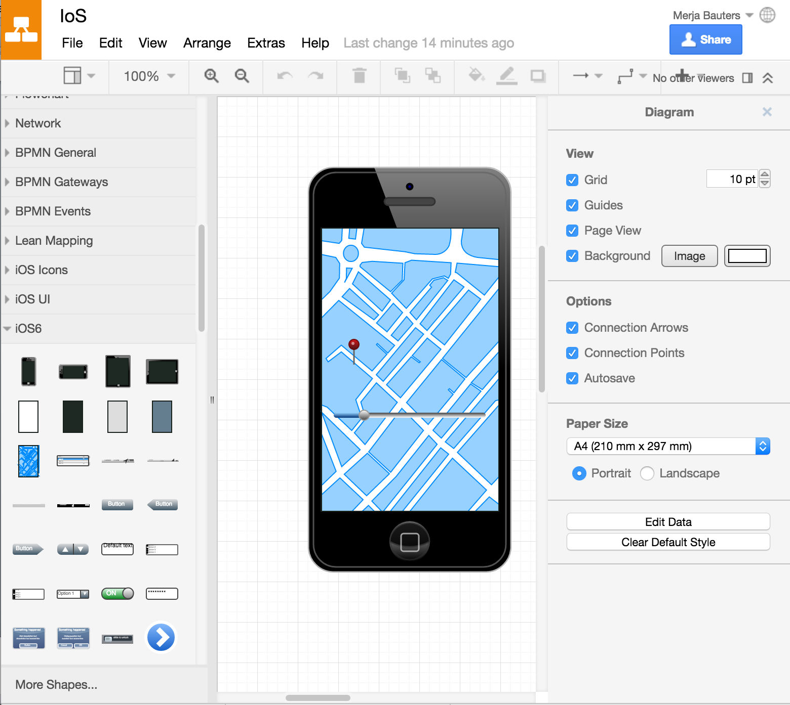

*Promoting Knowledge Practices in Education (KNORK) http://knork.info*

*The Re-Use Library*

**Tool suggestion: Draw.io – from low- to high-fidelity mock-ups**

**Author(s)**: Merja Bauters

**Affiliation(s)**: Metropolia UAS, Finland

**Date of publication**: April 7, 2016

**The educational problem**

When having design-oriented courses, it is a challenge to have a tool that allows joint working, sharing and embedding for creating mock-ups, and which is free, easy to use and available to most. In most cases, the provided tools are owned by big companies, which creates obstacles with the licenses – not all can afford them. Or the web tools for mock-ups and wireframe creation are free but available for particular amount of time and do not offer collaboration possibilities. All of the mentioned shortages hinder the process of drafting, designing and testing the design ideas, which should be developed iteratively and jointly to allow the growth of the mock-up from low-fidelity to high-fidelity.

**The solution**

Draw.io application, which can be added to the Google Drive tools, provides a welcome change into the tool repertoire for creating mock-ups and prototypes. Often Google docs are used for sharing reports, and the created mock-ups can be easily embedded into the reports. Since most have a Gmail account, it is easy to share the mock-ups and refine them together. Draw.io concentrates on the main items for mock-up creation, which makes the use easy; it does not require any additional learning of the tool itself. It has ready-made templates for IoS and Android as well Bootstrap, all of which are highly used in the time of “mobile first” and responsive design. Furthermore, for collaboration and joint creation of mock-ups, Draw.io has versioning and various clould saving possibilities. Therefore, continuing towards high-fidelity mock-ups can be achieved.

Main features

-   Draw.io can be integrated with [*Google Drive*](https://www.draw.io/?mode=google), [*OneDrive*](https://www.draw.io/?mode=onedrive) and [*Dropbox*](https://www.draw.io/?mode=dropbox). Furthermore it includes plugins for Atlassian's [*Confluence*](https://marketplace.atlassian.com/plugins/com.mxgraph.confluence.plugins.diagramly) and [*JIRA.*](https://marketplace.atlassian.com/plugins/com.mxgraph.jira.plugins.drawio)

-   It allows sharing, versioning and exporting in various formats as well as embedding possibilities, e.g., to Google docs and sites.

-   Draw.io offers various templates for creating mock-ups but also other brainstorming and programming templates.

Figure 1. A start of a mock-up for IoS device. In the left side are visible templates for different devices and for icons and other mock-up elements. Above are the usual File, Edit, View and Arrange options. On the right side is visible the main controls for the elements in the canvas.

**Key experiences**

So far the experience has been positive. It has enhanced the teamwork, not all team members have to be in the same place to contribute for the drafting of mock-ups. In addition, it has helped the commenting of the students’ mock-ups since the files can be shared. It has also made it easier to document the work. Namely, when the reports are written together using Google docs, it creares less hassle to include the examples from draw.io directly into the Google docs file. This combination also offers the updating of the mock-ups directly from the Google docs file. Due to this feature, the mock-ups are more up-to-date than they usually are in students’ reports. It might increase the iterative design, but this claim needs further investigation.

**Materials and links**

-   Website of Draw.io: [*https://www.draw.io*](https://www.draw.io)

-   Draw.io user manual: [*https://support.draw.io/display/DO/Draw.io+Online+User+Manual*](https://support.draw.io/display/DO/Draw.io+Online+User+Manual)

