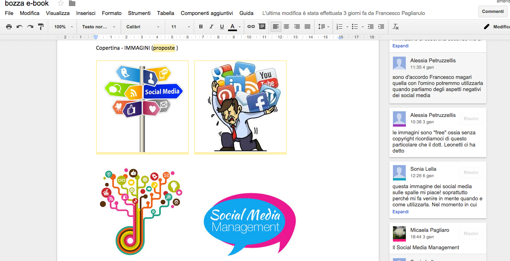

*Promoting Knowledge Practices in Education (KNORK) http://knork.info*

*The Re-Use Library*

**Tool suggestion: GoogleDrive - A digital space for collaborative knowledge creation**

**Author(s):** Beatrice Ligorio

**Affiliation(s)**: University of Bari, Italy

**Date of publication**: January 20, 2016

**The educational problem**

Sharing drafts is crucial to support collaborative learning. A digital space allows easy sharing and commenting. Furthermore, it was necessary to have a digital space where to upload documents provided by the teachers, examples of material produced by students in a previous course.

**The solution**

Google Drive is a free Google App that allows the organization of didactical materials into shared folders and sub-folders. Students are able to **organize their shared knowledge** in a hierarchical structure.

Google Drive provides free apps to create **shared objects** as documents (Google Docs), mental maps (Google Drawings) and presentations (Google Slides).

Users can **comment and add notes** on shared drafts and sketches of projects.

**Key experiences**

During the first week of the e-Learning Psychology university course, students became familiar with Google Drive. They downloaded didactical materials and created mind maps by using Google Drawings. Each student shared lesson notes into Google Drive.

During the first module students were asked to create a group’s shared mental map and to write individual reviews. The drafts were uploaded on Google Drive. Peers, tutors and teacher supervised the processes and gave feedback, adding comments and notes.

Students managed independently the folders’ hierarchical structures by opening new folders and subfolders.

During module 2, students were asked to create a shared object for real customers. Students used Google Docs to create Learning Objects concepts and storyboards, to write e-book contents and an App design. Students used Google Slides to prepare presentations of Serious Games design.

Figure 1. A Google Drawing to realize a collaborative conceptual map about the learning content of the first module: Learning Theories and Technology

Figure 2. A Google Drive doc in which student negotiates the content of a collaborative product to be build, by using the “comments” function

**Materials and links**

-   Google Drive: [*https://www.google.com/intl/eng\_eng/drive/*](https://www.google.com/intl/eng_eng/drive/)

-   Google Docs: [*https://www.google.com/intl/eng/docs/about/*](https://www.google.com/intl/eng/docs/about/)

-   Google Slides: [*https://www.google.com/intl/eng/slides/about/*](https://www.google.com/intl/eng/slides/about/)

-   Google Drawings:
    > [*https://chrome.google.com/webstore/detail/google-drawings/mkaakpdehdafacodkgkpghoibnmamcme*](https://chrome.google.com/webstore/detail/google-drawings/mkaakpdehdafacodkgkpghoibnmamcme)

