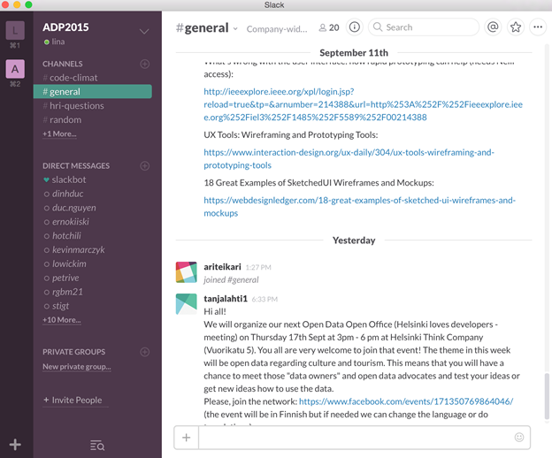

*Promoting Knowledge Practices in Education (KNORK) http://knork.info*

*The Re-Use Library*

**Tool suggestion**: **Slack – without boundaries for in need communication**

**Author(s)**: Merja Bauters

**Affiliation(s)**: Metropolia University of Applied Sciences

**Date of publication**: October 16, 2015

**The educational problem**

In multidisciplinary courses where outside educational system partners are involved, a channel for fast and easy communication is a must, otherwise issues get old, motivation dies out and emails that have become obsolete fill the inbox.

**The solution**

*Slack* is a tool that provides real-time communication for teams and broader groups without needing to belong to a specific organization. It provides direct messaging, private messaging, easy and fast file and link upload, integration to share code and files, for example in Google Drive, Dropbox, or Box; just paste the link and that document is immediately in sync and searchable in Slack too. It provides channels to organize the communication. It has native apps for iOS and Android.

The possibility to add people without thinking if they are in a particular institution or company is essential. Slack also provides means to belong to various institutions and companies and still see all the communication in one place. There is no need to jump from one account to another to see what occurs in different organizations (e.g., Helsinki university, Metropolia UAS, AALTO university). All person online can be seen, and separate channels for different communication topics can be created to organize the communication and messaging. Slack helps providing in-time on-place communication, questions, answers and guidelines that are targeted to the appropriate group of people.

**Key experiences**

Students in multidisciplinary courses have been happy to be able to get in-time answers without mixing their studies with free-time social media solutions such as Facebook. The outside customers of the courses have been more engaged than usual because they can get direct connection to the students without bothering the teachers/lectures and without the problem of thinking if their company solutions are fit for the particular kind of communication. The channels that organize the communication are helpful because one sees, in one view, where there are additions (also notifications are possible if one wants those). Teachers and lectures feel comfortable because they can easily link their materials and guidelines. All are up-to-date and no jumping from one app to another is needed.

Participants with multiple hats do not have to separate their views – they can see what occurs, e.g., in work and in education (as can be seen in Figure 2 where two Slack installations are presented, one is for work setting, another for educational course setting).

Figure 1. Two settings for Slack, L is for the work and A for a course setting. The active part of the window presents the course’s general channel: the teacher’s posting on materials is presented on the top, message of a joined person below that, and in the bottom part of the figure, the customer of the course has provided some general information that might interest the students in their work.

**Materials and links**

-   Web address of Slack: [*https://slack.com/is*](https://slack.com/is)

-   Official Slack guidelines: [*https://slack.com/getting-started*](https://slack.com/getting-started)

-   Slack help center: [*https://slack.zendesk.com/hc/en-us*](https://slack.zendesk.com/hc/en-us)

