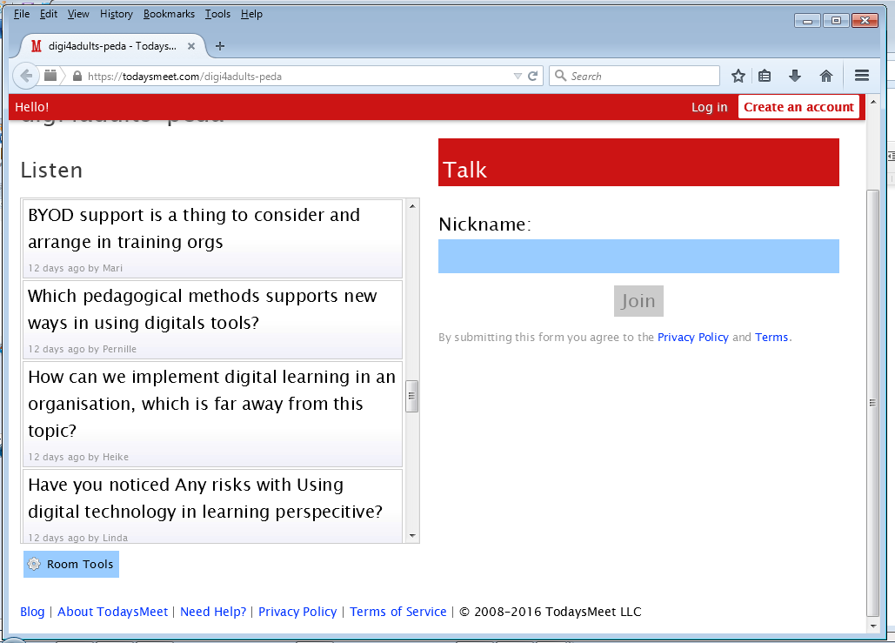

*Promoting Knowledge Practices in Education (KNORK) http://knork.info*

*The Re-use Library*

**Tool suggestion: TodaysMeet - a simple virtual message wall**

**Author(s)**: Minna Lakkala

**Affiliation(s)**: University of Helsinki, Finland

**Date of publication**: February 22, 2016

**The educational problem**

In various educational settings, there are needs to be able to quickly and easily create, share and examine together questions, viewpoints, ideas or comments among all participants, especially when there is not any virtual platform or knowledge management system taken in use.

**The solution**

One simple virtual message wall tool is TodaysMeet. Somebody has to create a wall and share its web-address, then anybody can write messages to the wall. The messages appear in the website of the wall in reversed chronological order. Each participant gives a name or nickname before writing the first message. The messages can be maximum 140 characters long.

It is possible to create a new message wall without creating an user account to the service; in such case the walls are preserved maximum one month. With a username, a user can create walls that are preserved maximum one year. There are no specific commands in the TodaysMeet service to extract the wall content, but it is possible to select the whole list of messages and copy-paste the text somewhere else for permanent saving or further processing.

**Key experiences**

TodaysMeet works very well through a browser both in computers, laptops, tablet computers and mobile phones. One good practice is to share the link to a wall for participants through a [*QR-code*](https://en.wikipedia.org/wiki/QR_code), if the participants have mobile tools.

TodaysMeet has been used, for example, at the beginning of an educational session or lecture to collect questions and comments from the participants based on their prior knowledge, or at the end of the session, lecture or course to collect feedback and new acquired viewpoints. It can also been used as a backchannel that is open throughout a lecture or session for collecting and sharing participants’ questions and comments; the lecturer may now and then go to the wall and react to new questions and comments.

In Figure 1 is a screenshot from a wall where workshop participants of the international [*Digi4Adults*](http://www.takk.fi/takk/hanketoiminta/kaeynnissae_olevat_hankkeet/digi4adults.html) project wrote questions and comments about pedagogical perspectives on learning in virtual spaces at the beginning of a workshop.

Figure 1. Screenshot of a TodaysMeet wall.

**Materials and links**

-   Website of *the TodaysMeet* service: [*https://todaysmeet.com/*](https://todaysmeet.com/)

