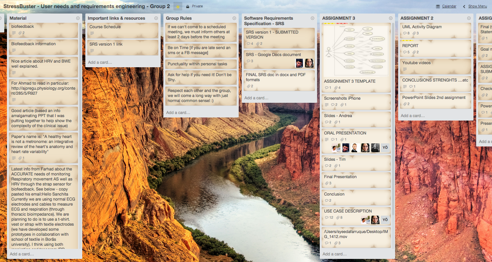

*Promoting Knowledge Practices in Education (KNORK) http://knork.info*

*The Re-Use Library *

**Tool suggestion: Trello - a web-based collaborative project management application**

**Author(s)**: Elnta Meragia & Klas Karlgren

**Affiliation(s)**: Dep of Learning, Informatics, Management and Ethics (LIME, Health Informatics Center) at Karolinska Institutet

**Date of publication**: March 11, 2015

**The educational problem**

The educational problem is how to easily, freely, flexibly, and visually organise and manage a project in a collaborative manner.

**The solution**

*Trello* is a collaboration tool that organizes your projects into boards. In one glance, Trello tells you what's being worked on, who's working on what, and where something is in a process.

When the user creates a new Trello board, there are three empty lists called “To Do”, “Doing” and “Done”. The user can modify these as he wishes by changing the name of the lists, modifying their content by adding Cards on which one can post something, upload files, add checklists, due dates etc. The user can add other contributors in the board and then assign to them tasks which are mentioned on the lists in the cards.

One can have total view of the activity on the board by checking the to-do lists, what remains to be done, by checking the activity of the members in the board and there are also notifications which notify the user about important events.

The basic version of Trello is for free but someone can have a Gold/Business Trello account by paying some extra, that provides a few more features such as enabling Calendar, Voting, Card Aging functions etc. which provide extra administrative control.

**Key experiences**

In general, the experience from Trello, has been positive by the students. In the beginning they have been sceptical towards its purpose and usability and how it can help with their teamwork since they compare it with Google Calendar but then after they have started using it for a longer time and in bigger projects they can see the real advantages it can offer as a project management tool. The students up to now have used it quite extensively for their group work projects and there has been a big progress on how they use it since the first time regarding the level of interaction and collaboration.

Some examples:

1.  Trello was used for a project in Health Informatics and where the students assigned roles to the members for each week. (In this case, the teacher was also added as a member of the team): [*https://trello.com/b/phQAOpOD/hicmas*](https://trello.com/b/phQAOpOD/hicmas)

2.  Trello was used for the second time by one group of students for a Health Informatics project where they needed to do three assignments and manage their group work in order to make sure that everything went fine. (The board is private, so an image is added for demonstration purposes. The teacher of the course was not added as a member of the board)

> 

**Materials and links**

-   Web address of Trello: [*https://trello.com/*](https://trello.com/)

-   Official Trello Tour: [*https://trello.com/tour*](https://trello.com/tour)

-   How to Use Trello Like a Pro: [*http://help.trello.com/article/734-how-to-use-trello-like-a-pro*](http://help.trello.com/article/734-how-to-use-trello-like-a-pro)

-   Getting Started - Trello Help: [*http://help.trello.com/category/694-category*](http://help.trello.com/category/694-category)

-   Very nice and Illustrative Way on Using Trello Like a boss (Highly recommended): [*http://wayfinder.is/michael/Using-Trello-Like-a-Boss/536a363251957a1100d4ebbf*](http://wayfinder.is/michael/Using-Trello-Like-a-Boss/536a363251957a1100d4ebbf)

